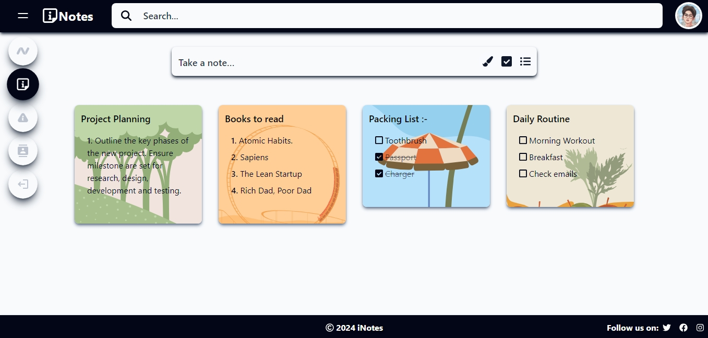
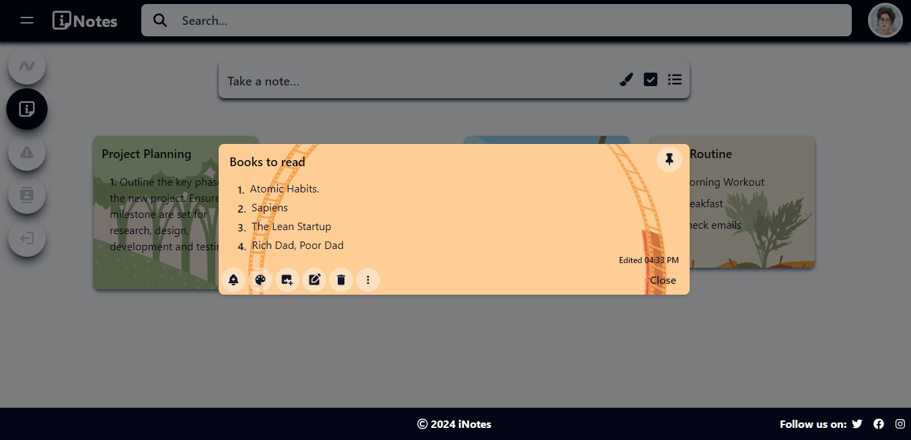
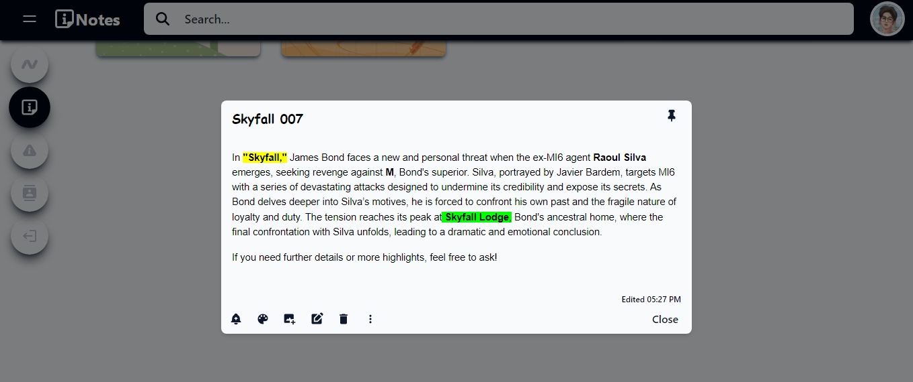

# iNotes

**iNotes** is a full-stack note-keeping application designed to enhance productivity and streamline organization. It offers a sleek interface for managing tasks, goals, and notes, while its backend is powered by **Node.js**, **Express**, and **MongoDB**.

## Features

- **Advanced Search:** Easily find notes using keyword search.
- **Checklist Support:** Create checklists for seamless task tracking.
- **Rich Text Editing:** Customize your notes with formatting options.
- **Reminders & Deadlines:** Set reminders for your tasks to keep you on track.
- **Tagging & Categorization:** Organize notes using tags and categories.
- **Custom Backgrounds:** Personalize your notes with background images or colors.

## Screenshots

Here are some screenshots showcasing iNotes:





## Preview Video

Watch the video below to see iNotes in action:

[Watch the demo](https://github.com/Nishant0128/iNotes/blob/main/preview/iNotes.mp4)

## Tech Stack

- **Frontend:** React, Tailwind CSS
- **Backend:** Node.js, Express
- **Database:** MongoDB
- **API:** RESTful API with secure endpoints

## Getting Started

### Prerequisites

Ensure you have the following installed:

- **Node.js**
- **MongoDB**
- **npm** for package management

### Installation

1. Clone the repository:

   ```bash
   git clone https://github.com/Nishant0128/iNotes.git
   ```

2. Navigate to the project directory:
   ```bash
   cd iNotes
   ```

### Backend Setup

1. Navigate to the backend directory:

   ```bash
   cd Backend
   ```

2. Install backend dependencies:

   ```bash
   npm install
   ```

3. Start the backend server:
   ```bash
   npm run dev
   ```
   The backend will run on `http://localhost:5000`.

### Frontend Setup

1. Navigate to the frontend directory:

   ```bash
   cd Frontend
   ```

2. Install frontend dependencies:

   ```bash
   npm install
   ```

3. Start the frontend development server:
   ```bash
   npm start
   ```
   The frontend will run on `http://localhost:5173`.

### Running the Full Application

1. Start the backend and frontend servers as described above.
2. Visit `http://localhost:5173` to use the iNotes app.
